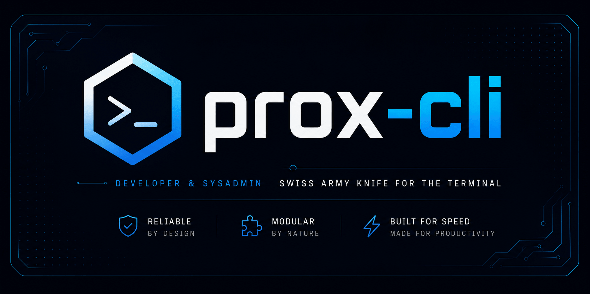

<div align="center">
<p align="center">
  
</p>



### Lightweight, modular, and extensible CLI toolkit for developers and security researchers

A modern Go-based command-line suite for everyday tasks such as encoding, password generation, hashing, port scanning, sample text generation, and AI-assisted terminal workflows.

> This project is currently in beta and is being actively shaped around a modular architecture that makes it easy to extend.

<br>

<p>

[Overview](#-overview) •
[Features](#-features) •
[Installation](#-installation) •
[Usage](#-usage) •
[Commands](#-available-commands)

</p>

<br>

[](https://go.dev)
[](LICENSE)
[]()

<br><br>

**⚡ Fast** • **🧩 Modular** • **🔐 Utility-focused** • **🛠 Developer-friendly**

</div>

---

> [!NOTE]
>
> prox-cli is designed as a lightweight and extensible toolkit. Its current focus is on practical CLI utilities that are easy to extend as the project grows.

# 🚀 Overview

<div align="center">


</div>

prox-cli is a modular command-line application written in Go. It combines a set of useful utilities into a single, easy-to-use tool for developers, pentesters, and researchers who want quick access to common operations directly from the terminal.

The project is built around a simple command registry, making it straightforward to add new functionality without rewriting the CLI structure. This modular design is one of the core strengths of the project, and new commands can be introduced by adding a small command file under the commands directory.

# ✨ Features

- 🎨 **Minimal Agent TUI**: Focused Bubble Tea interface with responsive text wrapping, status animation, command output, and explicit approval controls.
- 🤖 **Interactive Agent Mode**: AI terminal copilot available through `prox agent` and `prox ai agent`.
- 🧠 **Bounded Conversation Memory**: The agent keeps recent user, assistant, and command messages within a 6,000-character context budget.
- 🛡️ **Risk Review Layer**: Proposed commands are analyzed separately for destructive behavior, privilege escalation, data loss, and credential exposure before approval.
- 🔐 Base64 encoding and decoding with optional file input/output support
- 🧪 Secure random key generation with customizable character sets
- 🧮 Hash generation for MD5, SHA1, SHA256, and SHA512
- 🌐 Port scanning for a target host and a custom port range
- 📝 Lorem Ipsum text generation for testing and placeholders
- 🧩 **Extensible command architecture**: Commands are registered through a shared interface and registry.
- 🛠 Clean and minimal Go-based implementation

# 📁 Project Structure

```text
prox-cli/
├── commands/     # Command implementations
├── core/         # Shared CLI parser and helpers
├── main.go       # CLI entry point
├── go.mod        # Go module definition
├── LICENSE       # Apache 2.0 License
├── NOTICE     # Third-party software copyrights and legal notices
└── README.md     # Project documentation
```

# 📦 Installation

prox-cli requires Go 1.26 or newer.

You can also download prebuilt binaries from the Releases section of the repository when available.

## 1. Clone the repository

```bash
git clone https://github.com/msalihberk/prox-cli.git
cd prox-cli
```

## 2. Build the binary

```bash
go build -o prox .
```

## 3. Setup Prox

```bash
./prox setup
```

## 4. Run the CLI

```bash
prox help
```

You can also run it directly without building:

```bash
go run . help
```

# 💻 Usage

> [!NOTE]
> If you haven't entered a valid API key in the setup command before, use the `prox setup setup-env` command to add your API key as an environment variable for using ai features.

## Agent mode

Start the interactive terminal agent:

```bash
prox agent
# or
prox ai agent
```

The agent remembers recent conversation turns within a 6,000-character context limit. When it proposes a shell command, a separate risk review analyzes the command before the confirmation screen. Commands are never executed without explicit `Y` confirmation.

Here are a few common examples using the current command set:

```bash
# Base64 encode
prox b64 encode "hello"

# Base64 decode
prox b64 decode SGVsbG8=

# Generate a secure random key
prox keygen 16

# Generate a hash from a string
prox hash -s test

# Generate a hash from a file
prox hash -f sample.txt -b

# Scan open ports on a target
prox portscan example.com -p 80,443 -w 50 -t 1000

# Generate lorem ipsum text
prox lorem -w 12 -p 2

# Use AI helpers (requires PROX_API_KEY)
prox ai cmd "list files in the current directory"

# Start the interactive agent (requires PROX_API_KEY)
prox agent

```

# 🧰 Available Commands

| Command | Description |
| :--- | :--- |
| `help` | Display the available commands |
| `b64` | Encode or decode strings to and from Base64 |
| `keygen` | Generate random secure keys |
| `hash` | Compute the hash of a given input string or file securely |
| `myip` | Display public IP information |
| `portscan` | Scan a target host for open ports concurrently |
| `lorem` | Generate dummy Lorem Ipsum text for testing and placeholders |
| `ai` | Generate terminal commands, discover relevant modules, or explain logs and payloads |
| `agent` | Start the interactive AI agent with bounded context and command risk review |
| `setup` | Make it easier to access Prox, save your API key, and enable autocomplete |
| `version` | Show the current version of the CLI |

# 🧩 Adding Your Own Module

Create a Go file under `commands/`, implement the shared `core.Commander` interface, and register the command with `core.Register`. Use the parser from [core/getargs.go](core/getargs.go) for positional arguments and flags.

```go
package commands

import (
	"prox-cli/core"
)

type ExampleCommand struct{}

func (c ExampleCommand) Execute(args []string) error {
	return nil
}

func (c ExampleCommand) Description() string {
	return "Example command"
}
func (c ExampleCommand) Help() string {
	return "Usage: prox example"
}
func (c ExampleCommand) SubCommands() []string {
	return []string{"help"}
}
func init() {
	core.Register("example", ExampleCommand{})
}
```

# 📝 License

This project is licensed under the Apache License 2.0.

See [LICENSE](LICENSE) for more details.

Third-party notices are available in [NOTICE.md](NOTICE.md).
